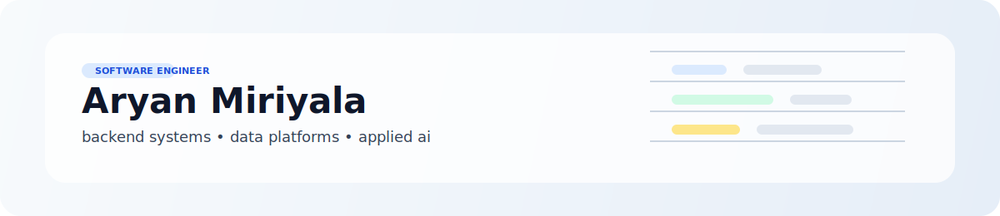
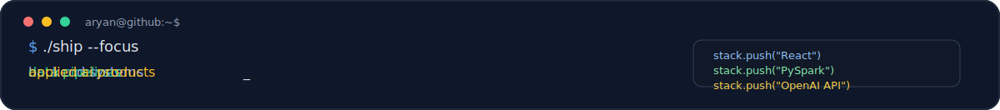
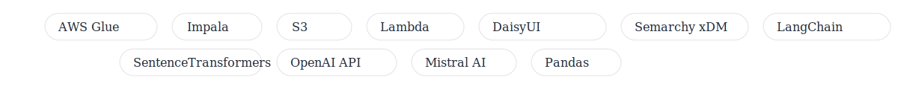

  

  

# Aryan Miriyala
Software and data engineer. AI4SE and cybersecurity researcher at BGSU. I build web apps, mobile apps, and data systems. Outside the terminal: horror movies and game dev ideas.

## Experience
- Data Engineering Intern, American Association of Insurance Services (2025)
- Software Engineering Intern, American Association of Insurance Services (2023–2024)
- Software Engineering Intern, Alliance for Paired Kidney Donation (2022)

  

## Projects
- FalconGraph Search: campus crawler + RAG search with graph context.
- DreamScape: mobile microlearning with audio cues + quizzes.
- Travel & Health Advisor: map-driven travel health guidance + AI.
- RocketGrades: LMS with AI grading + chat workflows.
- Super Mario RL: PPO/DQN training and evaluation.
- Yoda — Campus Navigator: Flutter app for campus navigation.

  

## Toolbox

  

  

  

  

  

  

## Skills
- Programming: Python, TypeScript, JavaScript, SQL, C++, C, Rust, Dart, Swift, Kotlin
- Web + mobile: React, Next.js, Angular, Node.js, Express, React Native, Expo, Flutter, Tailwind CSS, DaisyUI, Auth0
- Data: Databricks, Airflow, BigQuery, Hive, AWS Glue, Impala, Pandas, Hadoop, PySpark, Semarchy xDM
- AI/ML: PyTorch, TensorFlow, LangChain, OpenAI API, Mistral AI, SentenceTransformers
- Cloud + DB: AWS, S3, Lambda, Docker, Git, PostgreSQL, MongoDB, MySQL, Oracle

  

## Education
- M.S. in Computer Science (Software Engineering), Bowling Green State University (Expected 2026)
- B.S. in Computer Science, Bowling Green State University (2024)

  

## Contact
- Email: aryanmiriyala@gmail.com
- Website: https://aryanmiriyala.vercel.app
- LinkedIn: https://www.linkedin.com/in/aryan-miriyala/
- Link to resume: resume/resume.pdf

  

## GitHub

  

