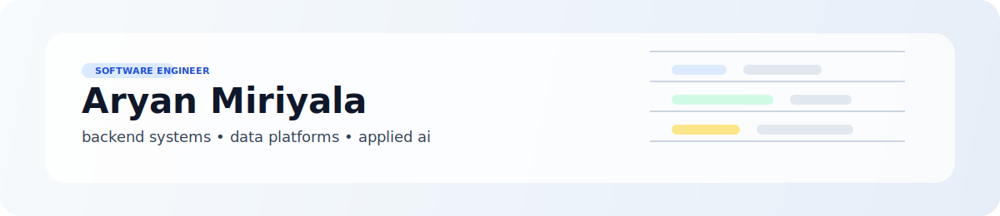
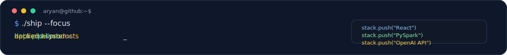

<p align="center">
  
</p>

<p align="center">
  
</p>

<p align="center">
  <a href="https://aryanmiriyala.vercel.app">portfolio</a> •
  <a href="https://www.linkedin.com/in/aryan-miriyala/">linkedin</a> •
  <a href="resume/resume.pdf">resume</a> •
  <a href="mailto:aryanmiriyala@gmail.com">email</a>
</p>

```bash
$ whoami
Aryan Miriyala

$ role
Software engineer building backend systems, data platforms, and AI-enabled products

$ current_focus
- production data workflows
- full-stack application engineering
- practical AI and retrieval systems

$ stack
Python • TypeScript • Node.js • React • PySpark • AWS Glue • PostgreSQL • MongoDB • OpenAI API
```

<table>
  <tr>
    <td valign="top" width="50%">

### `highlights.log`
- Automated a manual billing workflow over `20+ TB` of data with `PySpark` and `AWS Glue`
- Helped migrate `160+` legacy jobs into AWS-based ETL and partitioned `S3` pipelines
- Built secure internal app workflows with `React`, `Node.js`, `JWT`, and RBAC
- Contributed across `24 repositories`, working mostly in `Python` and `TypeScript`

    </td>
    <td valign="top" width="50%">

### `currently_shipping.md`
- Backend and data systems
- Full-stack product features
- RAG and AI-assisted product workflows
- Research in AI4SE and cybersecurity at BGSU

    </td>
  </tr>
</table>

### `featured_work/`
<!-- featured-projects:start -->
```txt
featured projects will be refreshed by GitHub Actions
```
<!-- featured-projects:end -->

### `toolchain.json`
```json
{
  "languages": ["Python", "TypeScript", "JavaScript", "SQL", "C++", "Rust"],
  "backend": ["Node.js", "Express", "REST APIs", "JWT", "Auth0"],
  "frontend": ["React", "Next.js", "Angular", "Tailwind CSS", "Flutter"],
  "data": ["PySpark", "Pandas", "Airflow", "Databricks", "AWS Glue", "Impala"],
  "ai": ["OpenAI API", "LangChain", "Mistral AI", "SentenceTransformers", "PyTorch"],
  "cloud": ["AWS", "S3", "Lambda", "Docker", "PostgreSQL", "MongoDB", "MySQL", "Oracle"]
}
```

### `recent_activity.log`
<!-- recent-activity:start -->
- activity summary will be refreshed by GitHub Actions
<!-- recent-activity:end -->
